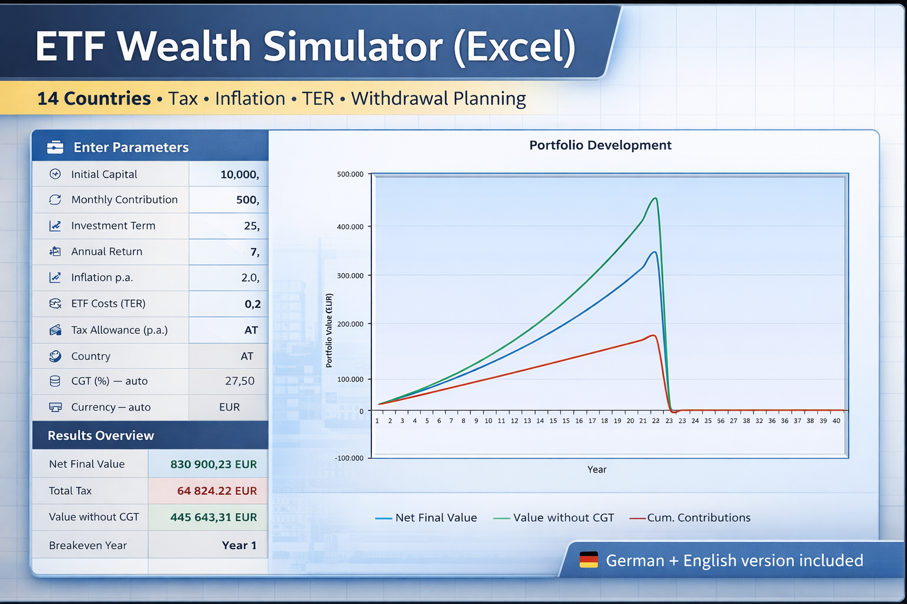

# ETF Portfolio Simulator (Excel) – Tax, Inflation & Withdrawal Calculator (14 Countries)

Download the full Excel simulator:
https://reimgun.gumroad.com/l/rqcfjr

Excel-based ETF portfolio simulator spreadsheet for long-term investing and retirement planning across multiple tax jurisdictions.

This tool works as an ETF tax calculator, ETF withdrawal calculator, ETF inflation calculator and ETF retirement calculator for long-term investors across 14 countries.

It can also be used as an ETF FIRE calculator for sustainable withdrawal strategies and retirement scenarios.

Supports realistic after-tax ETF portfolio projections for investors living in Germany, Austria, Switzerland, France, Spain, Portugal and across Europe.

---

## Preview

---

## Key Features

- Long-term ETF savings plan simulation
- Net portfolio value after taxes
- Inflation-adjusted purchasing power
- Withdrawal planner (4% rule simulation)
- Scenario comparison (pessimistic / realistic / optimistic)
- TER cost impact analysis
- Two configurable market crash years
- Goal calculator (required monthly investment)
- Annual portfolio development overview
- Charts and dashboard visualization
- Multi-country tax comparison (14 jurisdictions)

---

## Supported Countries

Austria  
Germany  
Switzerland  
Luxembourg  
France  
Italy  
Portugal  
Spain  
Malta  
Cyprus  
Greece  
Thailand  
Singapore  
United Arab Emirates (UAE)

---

## What this spreadsheet can be used for

This Excel simulator works as:

- ETF tax calculator Europe
- ETF withdrawal calculator spreadsheet
- ETF inflation calculator Excel
- ETF retirement calculator Excel
- after-tax ETF return calculator
- ETF FIRE calculator spreadsheet
- ETF portfolio simulator Excel

---

## Download Full Version

The complete Excel simulator (German + English versions included) is available here:

👉 https://reimgun.gumroad.com/l/rqcfjr

---

## About

This simulator was designed for long-term ETF investors who want realistic net portfolio projections instead of theoretical gross return estimates.

It includes country-specific tax assumptions, inflation adjustments and withdrawal planning tools for retirement scenarios.

---

## Keywords

ETF calculator Excel  
ETF tax calculator Europe  
ETF withdrawal calculator spreadsheet  
ETF inflation calculator Excel  
ETF retirement calculator Excel  
after-tax ETF return calculator  
ETF portfolio simulator Europe  
ETF FIRE calculator spreadsheet
